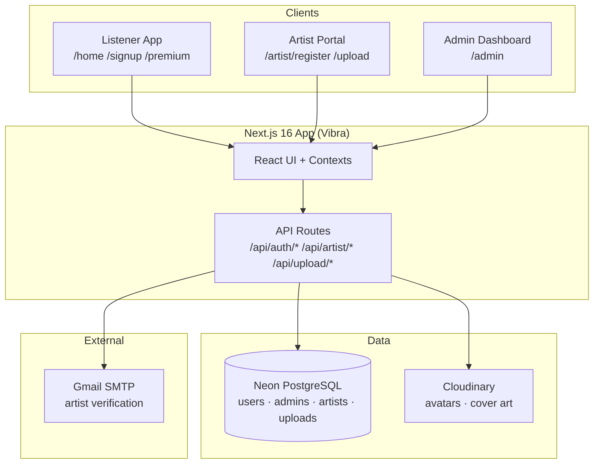
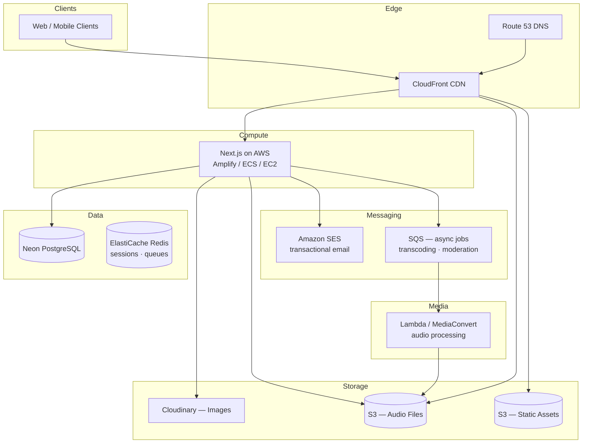
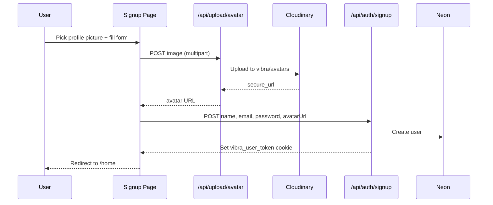
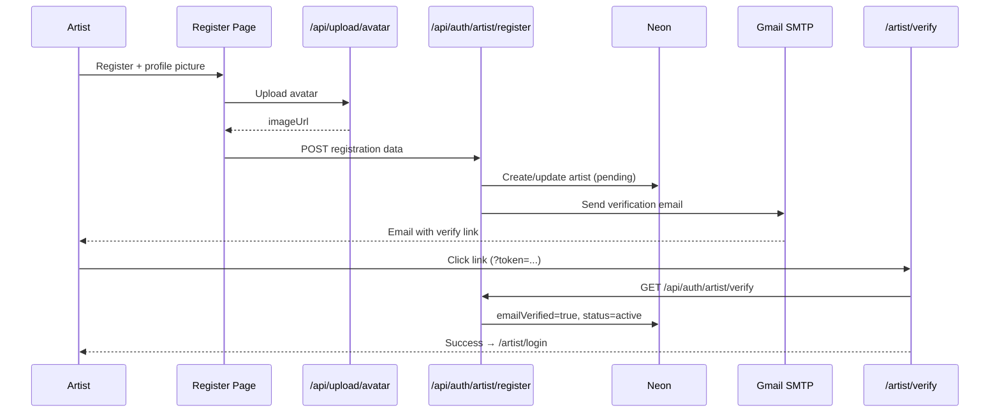
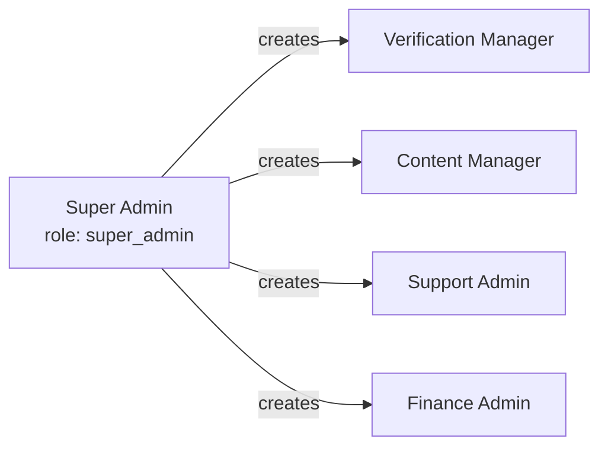
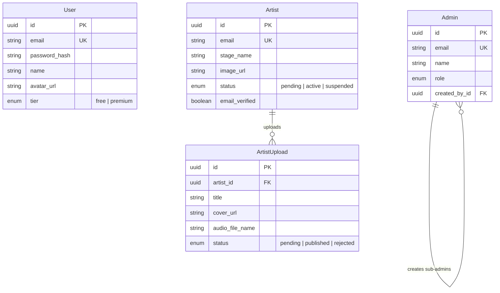

# Vibra

**Feel Every Beat** — a personalized music streaming platform built for listeners, artists, and platform operators.

Vibra is a Next.js application that combines a Spotify-style listener experience, a dedicated artist portal, and a full admin dashboard. The project is actively evolving from a frontend MVP into a production-ready platform backed by Neon PostgreSQL, with **AWS services planned** for media delivery, storage, and infrastructure at scale.

---

## Table of contents

- [What Vibra is](#what-vibra-is)
- [Current status](#current-status)
- [Architecture](#architecture)
- [Authentication flows](#authentication-flows)
- [Data model](#data-model)
- [Tech stack](#tech-stack)
- [Project structure](#project-structure)
- [Getting started](#getting-started)
- [Environment variables](#environment-variables)
- [API reference](#api-reference)
- [Roadmap](#roadmap)

---

## What Vibra is

Vibra serves three audiences:

| Audience | Portal | Purpose |
|----------|--------|---------|
| **Listeners** | Main app (`/home`, `/library`, `/premium`) | Discover music, manage library, upgrade to premium, social features |
| **Artists** | Artist portal (`/artist/*`) | Register, verify email, upload songs, view dashboard stats |
| **Admins** | Admin dashboard (`/admin/*`) | Super admin setup, reviewer management, content moderation (UI) |

---

## Current status

### Done

#### Listener experience
- Landing page, home feed, search, library, playlists, albums, artist pages
- Music player bar with queue, shuffle, repeat, likes, and downloads (mock playback)
- Premium page with tier upgrade (database-backed, **no Paystack yet**)
- Social features UI (community, messages, friend requests — mock data)
- **Real signup/login** against Neon PostgreSQL with httpOnly JWT cookies
- **Profile picture required** at listener signup (uploaded to Cloudinary)

#### Artist portal
- Separate artist login, registration, and protected dashboard
- **Email verification** via Gmail SMTP before artists can log in
- Resend verification for unverified accounts (register again or login page)
- Song upload form with metadata, lyrics, cover art, and copyright confirmation
- Uploads persisted to Neon; published songs appear in home feed **New from Artists**
- Artist profile picture required at registration (Cloudinary)
- Mobile-responsive artist shell and upload flows

#### Admin dashboard
- **Super admin** one-time registration (`/admin/register` when `ADMIN_OPEN_REGISTRATION=true`)
- Admin login with role-based navigation
- **Reviewer (sub-admin) creation** by super admin (verification, content, support, finance roles)
- Mock-driven modules: verification queue, music review, reports, support tickets, payouts, analytics

#### Backend & infrastructure (current)
- **Neon PostgreSQL** via Prisma ORM
- bcrypt password hashing, audience-scoped JWT auth (`user`, `admin`, `artist`)
- **Cloudinary** for avatar and cover image uploads
- **Nodemailer + Gmail SMTP** for artist verification emails
- Production build passing with Next.js 16 App Router

### In progress / not yet built

| Area | Status |
|------|--------|
| Real music playback APIs | Planned — home feed still merges DB uploads with mock catalog |
| Audio file storage (S3) | Planned — uploads store filename only today |
| Paystack payments | Placeholder — premium activates without payment |
| AWS infrastructure | Planned — see [Roadmap](#roadmap) |
| Content moderation pipeline | Admin UI exists; automated lyrics/audio screening not wired |
| OAuth (Google / Apple) | UI placeholders only |

---

## Architecture

### High-level system (today)



### Target architecture (with AWS — planned)



> **Note:** AWS components above are the intended direction. The app currently runs on Neon + Cloudinary + Gmail SMTP without AWS services deployed.

### Request flow — listener signup



### Request flow — artist registration & verification



### Admin hierarchy



---

## Authentication flows

| Role | Register | Login | Session cookie |
|------|----------|-------|----------------|
| Listener | `/signup` | `/login` | `vibra_user_token` |
| Super admin | `/admin/register` (once) | `/admin/login` | `vibra_admin_token` |
| Reviewer | Created by super admin | `/admin/login` | `vibra_admin_token` |
| Artist | `/artist/register` | `/artist/login` (after email verify) | `vibra_artist_token` |

**Security details:**
- Passwords hashed with bcrypt
- JWTs signed with `jose` (separate secrets for admin vs user/artist)
- httpOnly, `sameSite: lax` cookies — 7-day expiry
- Artist accounts require email verification before login

---

## Data model



---

## Tech stack

| Layer | Technology |
|-------|------------|
| Framework | Next.js 16 (App Router), React 19, TypeScript |
| Styling | Tailwind CSS 4 |
| Database | Neon PostgreSQL |
| ORM | Prisma 7 |
| Auth | bcryptjs, jose (JWT), httpOnly cookies |
| Images | Cloudinary |
| Email | Nodemailer + Gmail SMTP |
| Icons | Lucide React |

**Planned:** AWS (S3, CloudFront, SES, Lambda/MediaConvert, ElastiCache), Paystack, music metadata/streaming APIs

---

## Project structure

```
vibra/
├── app/
│   ├── (app)/          # Listener app (home, library, premium, social, …)
│   ├── (auth)/         # Login, signup, forgot-password
│   ├── admin/          # Admin login, register, dashboard
│   ├── artist/         # Artist login, register, verify, portal
│   └── api/
│       ├── auth/       # User, admin, artist auth routes
│       ├── artist/     # Upload CRUD
│       └── upload/     # Cloudinary avatar upload
├── components/
│   ├── admin/          # Admin shell and UI
│   ├── artist/       # Artist shell, upload form
│   ├── auth/         # Profile picture picker
│   └── layout/       # Sidebar, top bar, player bar
├── lib/
│   ├── auth/           # JWT, cookies, session, password
│   ├── contexts/       # Auth, player, admin, artist state
│   ├── cloudinary.ts   # Image upload helper
│   ├── email.ts        # SMTP verification emails
│   └── prisma.ts       # Database client
├── prisma/
│   └── schema.prisma   # Database schema
└── types/              # Shared TypeScript types
```

---

## Getting started

### Prerequisites

- Node.js 20+
- A [Neon](https://neon.tech) PostgreSQL database
- [Cloudinary](https://cloudinary.com) account
- Gmail account with [App Password](https://myaccount.google.com/apppasswords) for SMTP

### Installation

```bash
git clone https://github.com/ZeoFex/Vibra.git
cd Vibra
npm install
```

### Configure environment

Copy the example file and fill in your values:

```bash
cp .env.example .env.local
```

See [Environment variables](#environment-variables) below.

### Database setup

```bash
npx prisma db push
npx prisma generate
```

### Run locally

```bash
npm run dev
```

Open [http://localhost:3000](http://localhost:3000).

### First-time admin setup

1. Set `ADMIN_OPEN_REGISTRATION=true` in `.env.local`
2. Visit `/admin/register` and create the super admin account
3. Sign in at `/admin/login`
4. Create reviewer accounts under **Reviewers** in the dashboard

---

## Environment variables

| Variable | Required | Description |
|----------|----------|-------------|
| `DATABASE_URL` | Yes | Neon PostgreSQL connection string |
| `JWT_SECRET` | Yes | Secret for user/artist JWT signing |
| `ADMIN_JWT_SECRET` | Yes | Secret for admin JWT signing |
| `ADMIN_OPEN_REGISTRATION` | Yes | Set `true` to allow first super admin signup |
| `NEXT_PUBLIC_APP_URL` | Yes | Public app URL (e.g. `http://localhost:3000`) |
| `CLOUDINARY_URL` | Yes | Cloudinary connection URL |
| `SMTP_HOST` | Yes | e.g. `smtp.gmail.com` |
| `SMTP_PORT` | Yes | `465` (SSL) recommended for Gmail |
| `SMTP_SECURE` | Yes | `true` for port 465 |
| `SMTP_USER` | Yes | Gmail address |
| `SMTP_PASS` | Yes | Gmail app password (no spaces) |
| `SMTP_FROM` | Yes | e.g. `Vibra <you@gmail.com>` |

> Never commit `.env` or `.env.local`. Only `.env.example` with placeholders belongs in git.

---

## API reference

### Authentication — listeners

| Method | Route | Description |
|--------|-------|-------------|
| POST | `/api/auth/signup` | Create account (requires `avatarUrl`) |
| POST | `/api/auth/login` | Sign in |
| POST | `/api/auth/logout` | Sign out |
| GET | `/api/auth/me` | Current user |
| POST | `/api/auth/upgrade-premium` | Activate premium (no payment yet) |

### Authentication — admins

| Method | Route | Description |
|--------|-------|-------------|
| POST | `/api/auth/admin/register` | Create super admin (once) |
| POST | `/api/auth/admin/login` | Admin sign in |
| GET | `/api/auth/admin/me` | Current admin |
| GET/POST | `/api/auth/admin/sub-admins` | List/create reviewers (super admin only) |

### Authentication — artists

| Method | Route | Description |
|--------|-------|-------------|
| POST | `/api/auth/artist/register` | Register (requires `imageUrl`) |
| POST | `/api/auth/artist/login` | Sign in (verified artists only) |
| GET | `/api/auth/artist/verify?token=` | Verify email |
| POST | `/api/auth/artist/resend-verification` | Resend verify email |

### Uploads

| Method | Route | Description |
|--------|-------|-------------|
| POST | `/api/upload/avatar` | Upload profile picture to Cloudinary |
| GET/POST | `/api/artist/uploads` | Artist's uploads (auth required) |
| GET | `/api/artist/uploads/published` | Public published songs for home feed |

---

## Roadmap

### Phase 1 — Foundation *(current)*
- [x] Listener, artist, and admin portals
- [x] Neon PostgreSQL + Prisma
- [x] Real authentication with JWT cookies
- [x] Artist email verification
- [x] Profile pictures via Cloudinary
- [x] Artist uploads in database
- [x] Mobile responsiveness

### Phase 2 — Media & payments *(next)*
- [ ] Music metadata / streaming API integration
- [ ] Paystack subscription payments for premium
- [ ] Audio file upload to **AWS S3**
- [ ] CloudFront CDN for audio delivery
- [ ] Replace Gmail SMTP with **Amazon SES**

### Phase 3 — AWS production *(planned)*
- [ ] Deploy Next.js on AWS (Amplify, ECS, or EC2)
- [ ] S3 buckets for audio and static assets
- [ ] Lambda / MediaConvert for audio transcoding (multiple bitrates)
- [ ] SQS for async upload processing and moderation jobs
- [ ] ElastiCache Redis for sessions and rate limiting
- [ ] Route 53 + CloudFront for global delivery
- [ ] AWS IAM, Secrets Manager, and CloudWatch monitoring

### Phase 4 — Platform maturity
- [ ] Automated content moderation (lyrics + audio screening)
- [ ] Admin music review backed by real database state
- [ ] Artist analytics from real play/download events
- [ ] OAuth (Google, Apple) sign-in
- [ ] Native mobile apps

---

## Scripts

| Command | Description |
|---------|-------------|
| `npm run dev` | Start development server |
| `npm run build` | Production build (runs `prisma generate`) |
| `npm run start` | Start production server |
| `npm run db:push` | Push Prisma schema to Neon |
| `npm run db:migrate` | Create and run migrations |
| `npm run db:generate` | Regenerate Prisma client |
| `npm run lint` | Run ESLint |

---

## License

Private — ZeoFex / Vibra. All rights reserved.

---

<p align="center">
  <strong>Vibra</strong> — Feel Every Beat<br/>
  Built with Next.js · Neon · Cloudinary · AWS (coming)
</p>
